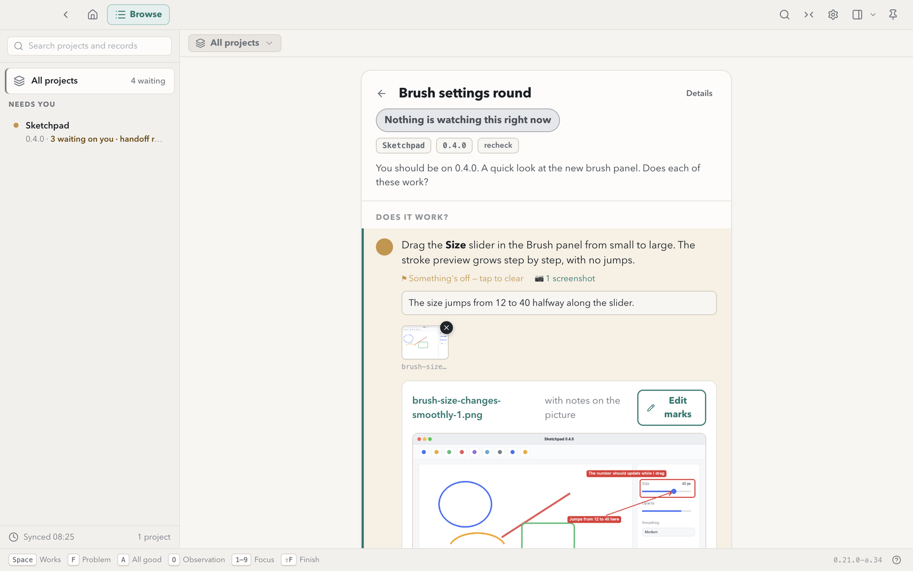

# Dev Traffic Control

A Mac app for the requests your coding agents send you. An agent writes a request as a Markdown file in one folder: a few things to try in the build it just made, or a document with decisions for you to take. Dev Traffic Control shows the request, you answer it with clicks, and the app writes your answer beside the request, where the agent reads it.

It is for developers who already work with coding agents such as Claude Code or Codex and are tired of answering "does it work?" in a chat window.



**Status: 0.22.0.** It runs on Apple Silicon Macs with macOS 12 or later. The record format may still change between releases; the app keeps the contract in your records folder current.

## What you can answer

- **Check requests.** A short list of things to try in your app. You mark each one works or not, add a comment, and paste a screenshot.
- **Design reviews.** A document with pictures and decisions. The pictures for each option sit side by side with a button under each, so you choose by looking.
- **Marked-up screenshots.** Draw arrows, boxes and text labels on a screenshot or on a review picture. The agent receives the words of every mark and where it points.
- **Handoffs.** A note for the next session saying where the work stands and what to do next, with a button that copies a prompt to continue it.

A `dtc://` link from an agent opens the request directly.

## Install

1. Download the `.dmg` from the [latest release](https://github.com/techczech/dev-traffic-control/releases/latest).
2. Open it and drag **Dev Traffic Control** to Applications.
3. Start the app and choose a records folder. The suggested folder is `~/Documents/Dev Traffic Control`; any folder works, and it can be a git repository.

The build is signed and notarised by Apple, so it opens without a security warning.

## Connect your agents

You do this once.

1. **Install the dev-traffic-control skill.** It teaches your agent the request format. Any agent that reads skills can use it. The skill is at [techczech/dominiks-agent-skills › dev/dev-traffic-control](https://github.com/techczech/dominiks-agent-skills/tree/main/dev/dev-traffic-control).

   Each release has the skill attached as `dev-traffic-control-skill.zip` (the maintainer attaches it to the release before publishing); unzip it into your agent's skills folder. Or clone it:

   ```sh
   git clone https://github.com/techczech/dominiks-agent-skills
   cp -R dominiks-agent-skills/dev/dev-traffic-control <your agent's skills folder>
   ```

2. **Tell your agent where to write.** Paste this to your agent once, with your own folder:

   ```text
   Use the dev-traffic-control skill. My records folder is ~/Documents/Dev Traffic Control. When you want me to test or review something, file it there and give me the dtc:// link.
   ```

3. **Or look around first.** The example project holds one check request, one design review and one handoff, so you can see what your agents will send.

4. **Optional: add the Claude Code mod.** See [The agent skill and the Claude Code mod](#the-agent-skill-and-the-claude-code-mod).

## The agent skill and the Claude Code mod

Two companions to the app, both optional beyond the skill.

- **The skill** (`dev-traffic-control`) teaches any agent the record format. It is attached to each release as `dev-traffic-control-skill.zip` and lives at [techczech/dominiks-agent-skills › dev/dev-traffic-control](https://github.com/techczech/dominiks-agent-skills/tree/main/dev/dev-traffic-control). To install it, unzip it into your agent's skills folder, or use the clone commands under Connect your agents.
- **The Claude Code mod** (`dtc-inbox`) adds a `/dtc` pane and a band that show answers waiting for the agent, and a `dtc_answers` tool that returns them to the agent as delimited data. It never acts by itself: it submits no prompt, and the agent reads an answer when you ask it to or when it calls the tool. Automatic delivery to the filing session is planned for a later release. It needs Claude Code with mods support. Install it with:

  ```sh
  claude plugin marketplace add techczech/dev-traffic-control
  claude plugin install dtc-inbox@dev-traffic-control
  ```

  It is also attached to each release as `dtc-inbox-mod.zip`, built by the release workflow from the tagged source. Unzip it and add the unzipped folder as a marketplace (`claude plugin marketplace add <the unzipped folder>`), then install as above. Its README is [claude-mod/dtc-inbox/README.md](https://github.com/techczech/dev-traffic-control/blob/main/claude-mod/dtc-inbox/README.md).

## The record format in brief

Everything is plain files in the records folder, one subfolder per project. The app never commits. If the folder is a git repository, the app runs `git pull --ff-only` in it only when you press **Pull now and open it** on a link whose record has not arrived yet, and it keeps a `.gitignore` in the folder for its own temporary files. Committing the folder is up to you.

```text
records folder/
  AGENTS.md                              the full contract, written and kept current by the app
  <project>/
    2026-01-15-export-check.md           a request (written by the agent, never edited)
    2026-01-15-export-check.report.json  your answers (written by the app)
    2026-01-15-export-check.shots/       your screenshots and marked-up pictures
    releases/0.11.0.md                   a release record, one heading per feature
    handoffs/2026-01-15-next-handoff.md  a handoff
```

A check request is Markdown with frontmatter; each `## heading` is one thing to check:

```markdown
---
title: Export round
app: Example App
version: 0.9.1
intro: You should be on 0.9.1. Does each of these work?
---

## Export to Word keeps the picture
Export a piece with an image to .docx and open it. The image is there.
```

A design review sets `kind: doc-review` and asks for decisions with a fenced `decision` block. An option line may carry its picture:

````markdown
```decision {#toolbar}
Where should the toolbar sit?
- A: along the top 
- B: down the left side 
```
````

The app writes your answers to `<request>.report.json`: a verdict and comment per check, the option you chose per decision, and every mark you drew with its words and position. The agent reads that file. The complete format is in the `AGENTS.md` the app writes into your records folder, and the [dev-traffic-control skill](https://github.com/techczech/dominiks-agent-skills/tree/main/dev/dev-traffic-control) teaches it to agents.

## Security model

The app reads and writes records only inside your records folder; its own settings live in the app's data folder. Every read and write of a record goes through one check: the folder holding the file must be a real folder at exactly that place below the records folder (no symlink anywhere on the way, whether it points outside or inside), and the file itself is opened without following a symlink, checked to be a regular file with exactly one name, and read or written through that one open file. A write goes to a new temporary file first, and the folder is checked again before the temporary file is renamed into place; any mismatch cancels the write. A `dtc://` link can only select a record that already exists inside the folder; it never writes.

What is refused:

- **Symlinks.** A symlinked file, or a file below a symlinked folder, is never read or written, whether the link points outside the records folder or inside it. Only the records folder itself may be reached through a link, because it is the place you chose.
- **Multiply-linked files (hard links).** A file that has more than one name is never read: one of its names could be a file outside the records folder, and nothing in the path shows it. The app never writes into an existing record file. Saving puts a new file under the record's name, so if that name was a hard link, the file's other names keep their old content. The one file the app rewrites in place is its own short-lived watcher probe in the records folder, and that write refuses a symlink or a multiply-linked file before it changes anything.
- **Anything that is not a regular file**: a folder, a device or a named pipe where a record should be.

What is outside this model:

- **A folder swapped during an operation.** A process running as you that renames or replaces folders inside the records folder in the instant between the app's last check and its open or rename can still redirect that one read or write. The app checks the folder again around each operation and cancels on a mismatch, but it cannot close the gap completely, because the operating system calls that would are not available to it. When a write is cancelled this way, its temporary file can be left behind in the folder that was moved.
- **Other names of a file that are created later.** The link count is checked when the file is opened. A second name given to the file after that does not affect the read already in progress.

Keep the records folder writable only by you and the agents you run.

## Build from source

You need Node.js 24 (the release workflow builds with Node 24, and the tests are run on 24.14) and a Mac. The tests do not depend on how Node's own Web Storage is configured: the renderer tests always use the test page's storage.

```sh
npm ci
npm run dev          # run the app from source
npm run typecheck
npx vitest run
npm run build:mac    # a local, unnotarised build in dist/
```

The layout tests lay the app's stylesheets out in Playwright's `chrome-headless-shell`. Install it with `npx playwright install chromium-headless-shell`, or set `CHROME_BIN` to a `chrome-headless-shell` binary. When it is not installed, those tests are skipped and say why; every other test still runs.

### Releases

Releases are built by GitHub Actions from a `v*` tag: a signed and notarised arm64 `.dmg` and `.zip`, and the Claude Code mod as `dtc-inbox-mod.zip`, uploaded to a draft release. The workflow refuses to upload anything it cannot vouch for:

- It releases only the tag that started it, and only from the repository named in `scripts/release-check.mjs` (a fork that makes its own releases changes that one line). The tag must be `v` plus the version in `package.json`, it must be fetched from the repository successfully, and the commit the run builds must be the fetched tag's commit. A manual run names the tag in its `tag` input and passes the same check. The check runs in the build job, at the start of the upload job, again as the last thing before the draft is created, and once more after the upload. Any command in it that fails, fails the run.
- It stops at once if any of the five Apple secrets is empty.
- It runs the Claude Code mod's typecheck and tests (`npm run typecheck:mod`, `npm run test:mod`).
- It packages with code signing forced, so a build that cannot be signed fails.
- It checks the built app, and the copy inside the `.zip`, with `codesign --verify --deep --strict`, `spctl -a -vv` (which must report a Notarized Developer ID) and `xcrun stapler validate`. The files are uploaded only when all three pass.
- It packages the mod from the files the repository tracks under `claude-mod/dtc-inbox/`, with `.claude-plugin/marketplace.json`, and records the SHA-256 of the `.dmg`, the `.zip` and `dtc-inbox-mod.zip` in one list.
- Building and verifying run with read-only access to the repository. A separate job receives the verified files, checks them against that list, and is the only one allowed to write the release.
- It attaches files only to a draft it created itself in that run. Any release that already exists for the tag, draft or published, fails the run before anything is uploaded; "no release exists" is read from the full list of the repository's releases, never from an error message. The draft is created with `--verify-tag`, so never for a tag the repository does not hold. To rebuild a draft, delete the draft release and run the workflow again.
- Its last step reads the release back (`node scripts/release-check.mjs assets <tag> --manifest <the checksum list>`) and fails loudly unless there is exactly one release for the tag, it is still a draft, it is the one the run created, and its files are exactly the files in the checksum list, no more and no fewer, each with the SHA-256 recorded there, and those are the app's `.dmg` and `.zip` under the names this version's build gives them and `dtc-inbox-mod.zip`. A file anyone added to the draft during the run fails the step. The step prints each file with its SHA-256.

What the workflow does not guarantee, and what the maintainer does:

- **Do not publish the draft until the run has finished.** Creating the draft and uploading its files are separate requests, so the draft is visible while files are still uploading. A draft published during the run would receive the remaining files as a published release; the last step then fails, and that release should be deleted.
- **Protect `v*` tags, once.** The checks cannot stop a tag from being moved or deleted after a run. In the repository's settings, add a tag ruleset (Settings › Rules › Rulesets › New tag ruleset) that targets `v*` and restricts updates and deletions. A release tag then always names the commit that was built.
- **Attach the skill before publishing.** `dev-traffic-control-skill.zip` is made from the skill's own repository, so the workflow cannot build it. After the run has finished, the maintainer zips the `dev/dev-traffic-control` folder and attaches it to the draft. Then a second, separate check, run by the maintainer before publishing:

  ```sh
  node scripts/release-check.mjs assets --after-manual v0.22.0
  ```

  This passes only when the release is a single draft holding exactly four files and nothing else: the app's `.dmg` and `.zip`, `dtc-inbox-mod.zip` and `dev-traffic-control-skill.zip`. The app's two files are known by their exact names, which the script works out from the tag's version and the packaging configuration (`package.json` and `electron-builder.yml`): for `v0.22.0`, `dev-traffic-control-0.22.0.dmg` and `Dev.Traffic.Control-0.22.0-arm64-mac.zip` (a GitHub release turns the spaces in the zip's name into periods). No file is taken for the app's because it ends in `.dmg` or `.zip`. Run it from a checkout of the repository. It fails while the skill's zip is missing and for any other file. Given the run's checksum list as well (`--manifest SHA256SUMS`, from the run's `verified-release-files` artifact, kept for one day), it also checks each of the run's three files against its SHA-256. The skill's zip has no recorded checksum: it is the maintainer's own file.

One check is manual, before you push the tag. `npm run test:mod` runs the mod's tests under vitest, where the tests that need the Claude Code host are skipped; a GitHub runner has no Claude Code. Run those in Claude Code yourself and tag only when they pass:

```sh
claude plugin validate claude-mod/dtc-inbox
claude plugin test claude-mod/dtc-inbox
```

## Licence

MIT. See [LICENSE](LICENSE).
