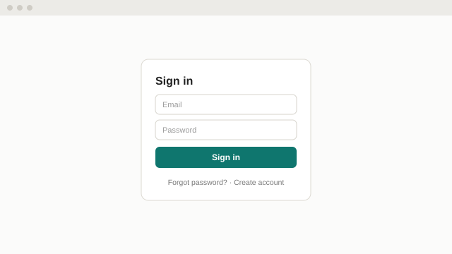
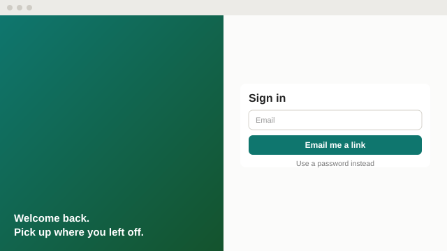

Two layouts for the sign-in screen. Both are drawn at the same size so the difference is the layout, not the styling.

## Sign-in screen

A is the quickest to build and what most users expect. B needs an email service but removes password resets.

```decision {#layout}
Which sign-in layout should the app use?
- A: Centred form on a plain page. Email and password. 
- B: Split screen with a welcome panel. Email link, no password. 
```
